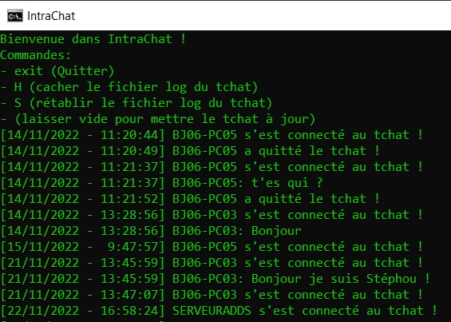

# IntraChat

IntraChat est un petit script permettant à deux ordinateurs connectés à un même lecteur réseau de s'envoyer des messages via un fichier texte partagé.
Ce script a été réalisé à la fois pour Windows et Linux.

> Windows

